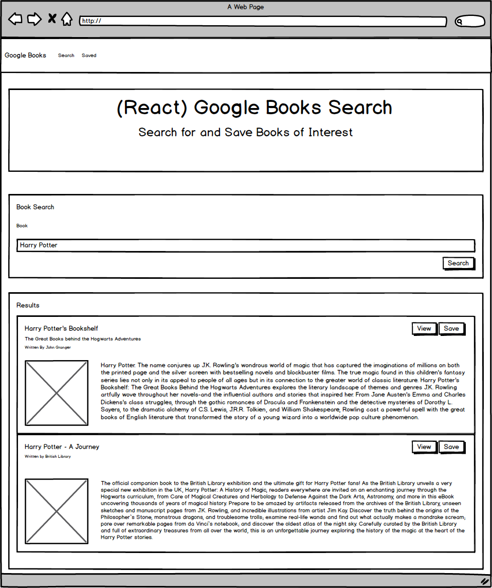

<<<<<<< HEAD
This project was bootstrapped with [Create React App](https://github.com/facebook/create-react-app).

## Available Scripts

In the project directory, you can run:

### `npm start`

Runs the app in the development mode. 
Open [http://localhost:3000](http://localhost:3000) to view it in the browser.

The page will reload if you make edits. 
You will also see any lint errors in the console.

### `npm test`

Launches the test runner in the interactive watch mode. 
See the section about [running tests](https://facebook.github.io/create-react-app/docs/running-tests) for more information.

### `npm run build`

Builds the app for production to the `build` folder. 
It correctly bundles React in production mode and optimizes the build for the best performance.

The build is minified and the filenames include the hashes. 
Your app is ready to be deployed!

See the section about [deployment](https://facebook.github.io/create-react-app/docs/deployment) for more information.

### `npm run eject`

**Note: this is a one-way operation. Once you `eject`, you can’t go back!**

If you aren’t satisfied with the build tool and configuration choices, you can `eject` at any time. This command will remove the single build dependency from your project.

Instead, it will copy all the configuration files and the transitive dependencies (webpack, Babel, ESLint, etc) right into your project so you have full control over them. All of the commands except `eject` will still work, but they will point to the copied scripts so you can tweak them. At this point you’re on your own.

You don’t have to ever use `eject`. The curated feature set is suitable for small and middle deployments, and you shouldn’t feel obligated to use this feature. However we understand that this tool wouldn’t be useful if you couldn’t customize it when you are ready for it.

## Learn More

You can learn more in the [Create React App documentation](https://facebook.github.io/create-react-app/docs/getting-started).

To learn React, check out the [React documentation](https://reactjs.org/).

### Code Splitting

This section has moved here: https://facebook.github.io/create-react-app/docs/code-splitting

### Analyzing the Bundle Size

This section has moved here: https://facebook.github.io/create-react-app/docs/analyzing-the-bundle-size

### Making a Progressive Web App

This section has moved here: https://facebook.github.io/create-react-app/docs/making-a-progressive-web-app

### Advanced Configuration

This section has moved here: https://facebook.github.io/create-react-app/docs/advanced-configuration

### Deployment

This section has moved here: https://facebook.github.io/create-react-app/docs/deployment

### `npm run build` fails to minify

This section has moved here: https://facebook.github.io/create-react-app/docs/troubleshooting#npm-run-build-fails-to-minify
=======
# Google-Books-Search

- In this activity, you'll create a new React-based Google Books Search app. This assignment requires you to create React components, work with helper/util functions, and utilize React lifecycle methods to query and display books based on user searches. You'll also use Node, Express and MongoDB so that users can save books to review or purchase later.

## Instructions/Demos

- This application requires at minimum 2 pages, check out the following mockup images for each page:

 - Search - User can search for books via the Google Books API and render them here. User has the option to "View" a book, bringing them to the book on Google Books, or "Save" a book, saving it to the Mongo database.

 - Saved - Renders all books saved to the Mongo database. User has an option to "View" the book, bringing them to the book on Google Books, or "Delete" a book, removing it from the Mongo database.

1. Start by using the 07-Ins_Mern example as a base for your application.

2. Add code to connect to a MongoDB database named googlebooks using the mongoose npm package.

3. Using mongoose, then create a Book schema.

4. At a minimum, books should have each of the following fields:

- title - Title of the book from the Google Books API

- authors - The books's author(s) as returned from the Google Books API

- description - The book's description as returned from the Google Books API

- image - The Book's thumbnail image as returned from the Google Books API

- link - The Book's information link as returned from the Google Books API

- Creating documents in your books collection similar to the following:
{
  authors: ["Suzanne Collins"]
  description: "Set in a dark vision of the near future, a terrifying reality TV show is taking place. Twelve boys and twelve girls are forced to appear in a live event called The Hunger Games. There is only one rule: kill or be killed. When sixteen-year-old Katniss Everdeen steps forward to take her younger sister's place in the games, she sees it as a death sentence. But Katniss has been close to death before. For her, survival is second nature."
  image: "http://books.google.com/books/content?id=sazytgAACAAJ&printsec=frontcover&img=1&zoom=1&source=gbs_api"
  link: "http://books.google.com/books?id=sazytgAACAAJ&dq=title:The+Hunger+Games&hl=&source=gbs_api"
  title: "The Hunger Games"
}

5. Create a layout similar to the mockups displayed above. This should be a SPA (Single Page Application) that uses react-router-dom to navigate, hide and show your React components without changing the route within Express.

- The layout should include at least two React Components for each page Search and Saved.

- Feel free to try out alternative CSS framework to Bootstrap.

- Add the following Express routes for your app:

- /api/books (get) - Should return all saved books as JSON.

- /api/books (post) - Will be used to save a new book to the database.

- /api/books/:id (delete) - Will be used to delete a book from the database by Mongo _id.

* (get) - Will load your single HTML page in client/build/index.html. Make sure you have this after all other routes are defined.

Deploy your application to Heroku once complete. You must use Create React App and current versions of React and React-Router-Dom for this assignment.

>>>>>>> d151d76e2c7b63aad89e57448d4a0a17f3252778
